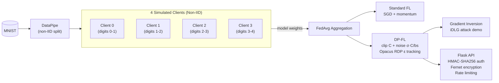

# PrivacyGuard FL

Privacy-preserving federated learning on MNIST with DP-SGD, gradient-inversion attack demo, and authenticated API deployment.

## System Architecture



## Quick Start

```bash
python3 -m venv .venv && source .venv/bin/activate
pip install -r requirements.txt && pip install -e .
python main.py full          # train → attack → summary
```

## CLI Commands

| Command | Action |
|---------|--------|
| `python main.py train` | Train Standard FL + DP-FL. Flags: `--rounds 20 --epsilon 8.0 --lr-dp 0.3` |
| `python main.py attack` | iDLG reconstruction (unprotected vs DP-protected gradients) |
| `python main.py deploy` | Start authenticated prediction API on `:5000` |
| `python main.py full` | train → attack → deploy instructions |

## Benchmark (seed 42, 20 rounds, 1500 samples/client)

| Metric | No-DP | DP (ε=8) |
|--------|-------|----------|
| Test accuracy | 97.2% | 84.0% |
| Attack MSE | 0.72 | 1.30 |

## DP-SGD

| Parameter | Value |
|-----------|-------|
| Clip norm C | 1.0 |
| ε | 8.0 (configurable) |
| δ | 1e-5 |
| Noise on averaged grad | `σ·C / batch_size` |

**Noise bugfix** (`dp_client.py:105`): noise std was `σ·C` — `batch_size`× too large for averaged gradients. Divided by `batch_size` to match DP-SGD accounting.

## API Security

| Property | Mechanism |
|----------|-----------|
| Auth | HMAC-SHA256 per-request (X-Signature, X-Timestamp, X-Nonce) |
| Confidentiality | Fernet (AES-128-CBC + HMAC-SHA256) |
| Rate limiting | 120 req / 60s per IP |
| Transport | Not provided (use reverse proxy for TLS) |

## Docker

```bash
docker compose build
docker compose run train
docker compose up api
```

## Project Layout

```
PrivacyGuard FL/
├── main.py, pyproject.toml, setup.py, Dockerfile
├── src/
│   ├── data/pipeline.py, core/federated.py
│   ├── differential_privacy/dp_client.py
│   ├── attacks/gradient_inversion.py
│   ├── deployment/api.py
│   └── ui/visualization.py
├── tests/ (25 tests), notebooks/, output/
└── .github/workflows/ci.yml
```

## Limitations

- Simulated clients (single process, sequential local training)
- No TLS; wrap with nginx/Caddy for production
- MNIST only; CNN generalizes with data pipeline adaptation

## Tests

```bash
pytest tests/ -v -m "not slow"
```
